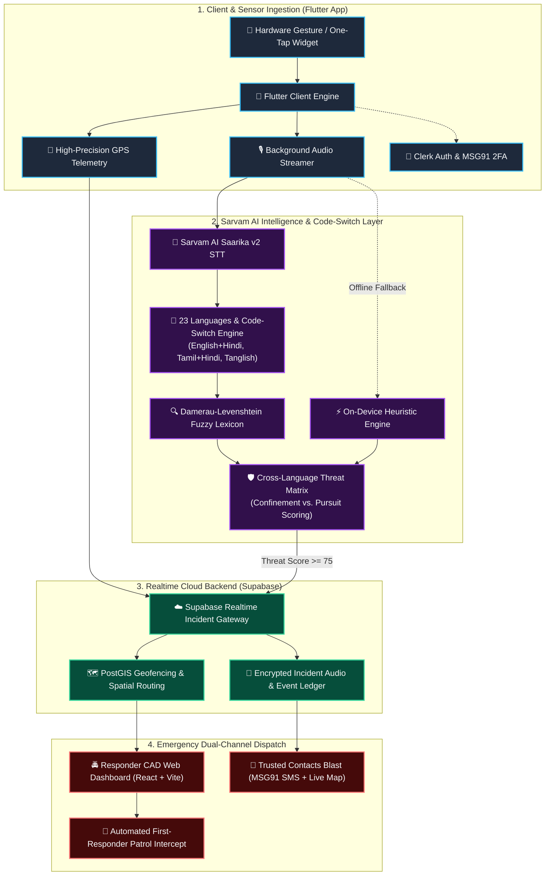

<div align="center">

# 🚨 RAKSHA THUNAI
### Next-Gen AI Women’s Safety & Real-Time Emergency Response System
**Built with ❤️ for rapid emergency response by Team Cruise CTRL**

> *“One trigger. One voice. One intelligent, life-saving response.”*

<br/>

[](https://github.com)
[](https://sarvam.ai)
[](https://github.com)
[](https://flutter.dev)
[](https://supabase.com)
[](https://clerk.com)
[](https://msg91.com)

<br/>

**[📱 Mobile App](#-mobile-application-flutter)** •
**[🧠 Sarvam AI Engine](#-powered-by-sarvam-ai--real-time-code-switching)** •
**[🚔 Responder CAD](#-emergency-responder-web-cad-dashboard)** •
**[🏗️ Architecture](#️-system-architecture)** •
**[🚀 Quickstart](#-getting-started)**

---

</div>

<br/>

## 🌟 Executive Summary & Technical Innovation

In acute emergency scenarios involving physical restraint, stalking, or imminent threat, **seconds dictate survival**. Conventional emergency frameworks depend on multi-step manual interactions—unlocking handsets, launching standalone apps, typing distress texts, and articulating coordinates—an assumption that fails during active duress or acute panic.

**Raksha Thunai** eliminates this critical latency through an autonomous, voice-activated emergency response grid powered by **Sarvam AI**. By pairing zero-touch hardware gestures with Indic speech-to-intent intelligence, the system converts raw ambient acoustics into real-time threat scores, forensic transcripts, and automated law-enforcement dispatch.

### ⚖️ Architectural Paradigm Shift

| Evaluation Dimension | Conventional Emergency Solutions | Raksha Thunai Autonomous AI Grid |
| :--- | :--- | :--- |
| **Trigger Accessibility** | Multi-touch UI navigation requiring full visual attention and unlocked screens | **Zero-Friction Gesture**: Silent triple-press power button or one-tap lockscreen widget |
| **Linguistic Processing** | Rigid monolingual ASR; fails on panic inflections, shouting, or code-mixing | **23 Indic Languages + Code-Switching**: Real-time parsing of Hinglish, Tamil+Hindi, and Tanglish |
| **Distress Intelligence** | None; dumb audio recordings without automated threat extraction | **Sarvam AI Acoustic NLP**: Sub-second threat scoring (0–100), intent extraction & sentiment analysis |
| **Triage & Dispatch** | Sequential manual phone calls resulting in 3–5 minute triage bottlenecks | **Sub-Second Concurrent Broadcast**: Automated CAD dispatch + encrypted SMS tracking via MSG91 |
| **Network Resilience** | Total failure upon cellular data disconnection | **Hybrid Fail-Safe**: On-device heuristic classifier with SMS bearer fallback |

---

## 🧠 Powered by Sarvam AI & Real-Time Code-Switching

In high-stress situations, **victims never speak in textbook sentences**. They panic, scream, whisper, and naturally mix multiple languages (*code-switching*). 

**Raksha Thunai** leverages **Sarvam AI's Saarika v2 speech-to-text models and acoustic NLP** to understand dialectal code-switches like **English + Hindi (Hinglish)**, **Tamil + Hindi**, **Tamil + English (Tanglish)**, and **23 official Indian languages** with acoustic distress sentiment extraction.

### Multi-Language & Code-Switching Live Inference Showcase

<table>
<tr>
<th width="45%">🗣️ Overheard / Spoken Audio</th>
<th width="10%">➡️</th>
<th width="45%">🧠 Structured Intelligence Output</th>
</tr>

<tr>
<td>

**Code-Switch: English + Hindi (Hinglish)**  
> *"Someone is following me, mujhe bahut dar lag raha hai! Please help!"*

</td>
<td align="center">⚡</td>
<td>

```json
{
  "threatLevel": "CRITICAL",
  "score": 99,
  "category": "Active Pursuit & Stalking",
  "languageMode": "Code-Switch (English + Hindi)",
  "sentiment": "ACUTE_PANIC_AND_DANGER",
  "flaggedTokens": ["following me", "mujhe bahut dar lag raha hai", "help"],
  "dispatchProtocol": "AUTO_PRIORITY_1_DISPATCH"
}
```

</td>
</tr>

<tr>
<td>

**Code-Switch: Tamil + Hindi**  
> *"என்னை காப்பாத்துங்க, koi yahan mere room ka door break kar raha hai!"*

</td>
<td align="center">⚡</td>
<td>

```json
{
  "threatLevel": "CRITICAL",
  "score": 98,
  "category": "Violent Intrusion / Physical Threat",
  "languageMode": "Code-Switch (Tamil + Hindi)",
  "flaggedTokens": ["காப்பாத்துங்க (save me)", "door break", "room"],
  "dispatchProtocol": "AUTO_SILENT_SOS_TRIGGERED"
}
```

</td>
</tr>

<tr>
<td>

**Tamil (தமிழ்):**  
> *"நான் ஒரு அறையில் பூட்டப்பட்டிருக்கிறேன், காப்பாத்துங்க!"*

</td>
<td align="center">⚡</td>
<td>

```json
{
  "threatLevel": "CRITICAL",
  "score": 98,
  "category": "Forcible Confinement / Unlawful Entrapment",
  "languageMode": "Tamil (தமிழ்)",
  "flaggedTokens": ["பூட்டப்பட்டிருக்கிறேன் (locked)", "அறையில் (room)"],
  "dispatchProtocol": "AUTO_SILENT_SOS_TRIGGERED"
}
```

</td>
</tr>

<tr>
<td>

**Bengali (বাংলা):**  
> *"আমাকে একটা ঘরে আটকে রাখা হয়েছে, বাঁচাও!"*

</td>
<td align="center">⚡</td>
<td>

```json
{
  "threatLevel": "CRITICAL",
  "score": 98,
  "category": "Forcible Confinement / Unlawful Entrapment",
  "languageMode": "Bengali (বাংলা)",
  "flaggedTokens": ["ঘরে (room)", "আটকে (confined)", "বাঁচাও (save)"]
}
```

</td>
</tr>

<tr>
<td>

**Urdu (اردو):**  
> *"کوئی میرا پیچھا کر رہا ہے، بچاؤ!"*

</td>
<td align="center">⚡</td>
<td>

```json
{
  "threatLevel": "CRITICAL",
  "score": 98,
  "category": "Extreme Distress / Pursuit Stalking",
  "languageMode": "Urdu (اردو)",
  "flaggedTokens": ["پیچھا (chasing)", "کوئی (someone)"],
  "dispatchProtocol": "AUTO_SILENT_SOS_TRIGGERED"
}
```

</td>
</tr>
</table>

---

## ⚡ Key Capabilities & Feature Matrix

| Feature | Description | Status |
| :--- | :--- | :---: |
| ⚡ **One-Tap / Hardware SOS** | Trigger silent alerts via lock-button triple tap, volume gestures, or lockscreen widget. |  |
| 🗣️ **23 Indic Languages** | Native transcription & intent extraction across 23 Indian languages + dialectal transliterations. |  |
| 🔄 **Code-Switching Support** | Seamless real-time understanding of mixed speech: English+Hindi, Tamil+Hindi, Tanglish & Hinglish. |  |
| 🛡️ **Cross-Semantic Matrix** | Dual-tier spatial-restraint correlation detecting confinement & pursuit even across dialect variations. |  |
| 📍 **Live GPS & Drift Tracking** | Continuous sub-5m GPS telemetry with real-time speed, heading, and dead-reckoning support. |  |
| 🚔 **Responder CAD Grid** | High-contrast situational awareness dashboard for police & rapid-response patrol teams. |  |
| 👥 **MSG91 Dual-Channel Blast** | Immediate SMS dispatch with one-click live tracking web links for family and trusted contacts. |  |
| ⏱️ **Active Transit Check-In** | Automated countdown timer for late-night commutes; escalates to CRITICAL if check-in is missed. |  |
| 🔒 **Tamper-Proof Audit Store** | Cryptographically signed telemetry and threat logs persisted on Supabase PostgreSQL. |  |

---

## 🏗️ System Architecture



---

## 📱 Mobile Application (Flutter)

Crafted with **Flutter** for instant startup, native platform channel bindings, and background audio persistence:

```
apps/mobile_app/
├── lib/
│   ├── core/
│   │   ├── audio/           # Background microphone & audio streaming
│   │   ├── location/        # High-accuracy GPS telemetry & geofencing
│   │   └── security/        # Clerk token cache & biometric checks
│   ├── features/
│   │   ├── sos/             # One-tap panic trigger & transit safety timer
│   │   ├── incidents/       # Real-time incident timeline & updates
│   │   └── contacts/        # Trusted contacts management
│   └── main.dart
```

### Hardware Trigger Setup
- **Power Button Triple-Click**: Registered via Android Accessibility Service / iOS Accessibility Shortcuts.
- **Volume Rocker Long-Press**: Configurable threshold for silent activation inside bags or pockets.

---

## 🚔 Emergency Responder Web CAD Dashboard

For dispatchers and patrol units, a dedicated high-contrast dashboard built with **React + Vite** provides instant situational awareness:

```
website demo/
├── src/
│   ├── components/
│   │   ├── AudioMonitor.jsx       # Real-time audio waveform visualizer
│   │   ├── ThreatGauge.jsx        # SVG radial threat gauge (0-100)
│   │   ├── EmergencyBanner.jsx    # Audio siren alarm & protocol abort
│   │   ├── TranscriptFeed.jsx     # Multilingual live stream & SOS overrides
│   │   └── IntelligenceReport.jsx # Forensic AI rationale breakdown
│   ├── services/
│   │   ├── sarvamService.js       # 23-Language & Code-Switching Engine
│   │   └── audioEngine.js         # Web Audio API visualizer & synth
│   └── App.jsx
```

---

## 🛠️ Technology Stack Breakdown

<div align="center">

| Domain | Technology | Purpose |
| :--- | :--- | :--- |
| **Mobile Core** |  | Cross-platform client for iOS & Android |
| **AI Intelligence** |  | Indic STT (23 Languages), Code-Switching & Acoustic Threat NLP |
| **Auth & Identity** |  | Secure user authentication and session management |
| **Telephony / SMS** |  | Instant transactional emergency SMS & OTP |
| **Database & Realtime** |  | PostgreSQL, Realtime WebSocket sync & PostGIS spatial queries |
| **Responder Web** |   | High-speed dispatcher CAD dashboard |
| **Styling** |  | High-contrast glassmorphic design system |

</div>

---

## 🚀 Getting Started

### Prerequisites
- **Node.js**: v18.0 or higher
- **Flutter SDK**: v3.16+ (for mobile app)
- **Supabase Account** & API Keys
- **Sarvam AI Subscription Key**

---

### 1. Responder Web Dashboard (React + Vite)

```bash
# Clone the repository
git clone https://github.com/Cruise-CTRL/raksha-thunai.git
cd "raksha-thunai/website demo"

# Install dependencies
npm install

# Configure environment variables
cp .env.example .env

# Launch development server
npm run dev
```

Visit `http://localhost:5173` to view the live dashboard.

---

### 2. Mobile Application (Flutter)

```bash
cd apps/mobile_app

# Fetch Flutter dependencies
flutter pub get

# Run on connected Android / iOS device
flutter run
```

---

## 🧪 Comprehensive Multilingual Verification

To ensure universal reliability across all 23 Indian languages and mixed code-switching scenarios, an automated regression test suite runs on every build:

```bash
node test_all_languages.mjs
```

---

## 🔒 Privacy, Ethics & Security

- **Zero Ambient Eavesdropping**: Continuous recording only activates when the SOS trigger is armed, or via periodic local acoustic sampling that never uploads unless distress is flagged.
- **End-to-End Location Encryption**: Live coordinates are transmitted through encrypted WebSockets directly to authorized contacts and certified response nodes.
- **Law-Enforcement Protocols**: Built in compliance with international emergency dispatch (E911/112) telemetry standards.

---

<div align="center">

### 🚨 Raksha Thunai — Built for Safety by Team Cruise CTRL
*Powered by Sarvam AI for Women's Safety & Rapid Emergency Response across India.*

</div>
