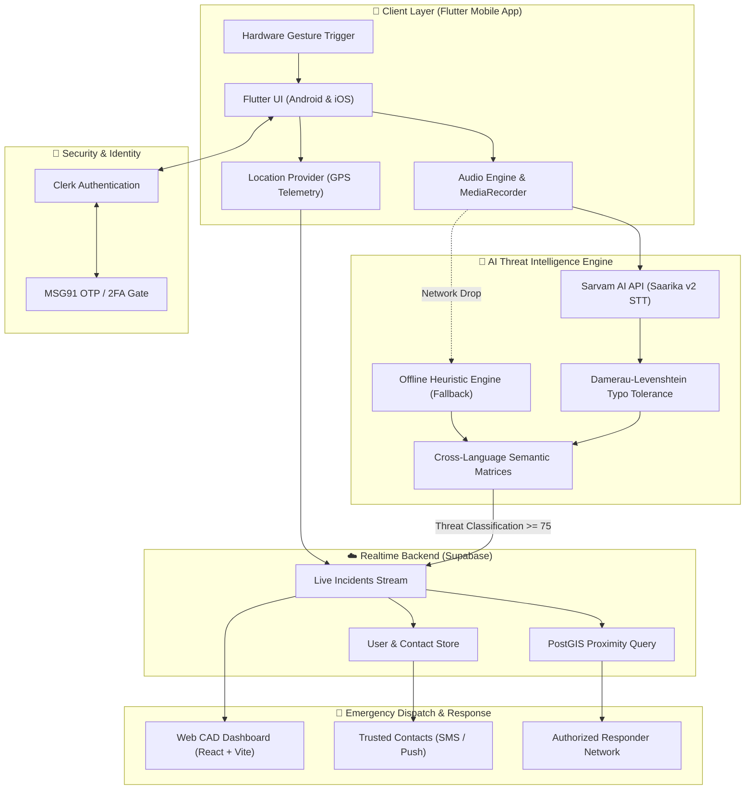

<div align="center">

# 🚨 SARVAM SHIELD
### Next-Gen AI Women’s Safety & Real-Time Emergency Response System
> *“One trigger. One voice. One intelligent, life-saving response.”*

<br/>

[](https://github.com)
[](https://sarvam.ai)
[](https://flutter.dev)
[](https://supabase.com)
[](https://clerk.com)
[](https://msg91.com)

<br/>

**[📱 Mobile App (Flutter)](#-mobile-application)** •
**[🧠 AI Intelligence Layer](#-powered-by-sarvam-ai)** •
**[🚔 Responder Dashboard](#-emergency-responder-network)** •
**[🏗️ Architecture](#-system-architecture)** •
**[🚀 Quickstart](#-getting-started)**

---

</div>

<br/>

## 🌟 Executive Overview

During an imminent threat, **every millisecond counts**. Traditional emergency systems require victims to unlock their smartphone, search for an app, type a distress SMS, and verbally explain their coordinates—steps that are virtually impossible under duress, physical confrontation, or unlawful restraint.

**SARVAM SHIELD** fundamentally transforms this paradigm. Powered by **Sarvam AI**, it allows individuals in distress to trigger an emergency through hardware gestures or 1-tap widgets, speak naturally in their native language (*Hindi, Tamil, Urdu, Bengali, Telugu, Kannada, etc.*), and let on-device and cloud NLP **extract threat type, severity, location, and distress sentiment automatically**.

```
    ⚡ ONE-TAP / HARDWARE TRIGGER
                 ↓
    🎙️ AMBIENT AUDIO + 📍 LIVE GPS TELEMETRY
                 ↓
    🧠 SARVAM AI ACOUSTIC NLP ENGINE
    ├── 21 Indian Languages & Transliterations (Hinglish/Tanglish)
    ├── Typo-Tolerant Damerau-Levenshtein Matching
    └── Cross-Semantic Matrices (Confinement & Active Pursuit)
                 ↓
    🚨 REAL-TIME INCIDENT TRIANGULATION
         ↙️                           ↘️
👥 TRUSTED CONTACTS             🚔 EMERGENCY RESPONDER NETWORK
├── Encrypted GPS Coordinates    ├── Live Proximity Heatmap
├── Automated SMS via MSG91      ├── Triage Prioritization (Critical/High)
└── Incident Audio Transcript    └── First-Responder GPS Dispatch
```

---

## 🧠 Powered by Sarvam AI: The Core Intelligence Engine

**Sarvam AI acts as the sensory brain of our platform.** It converts real-time acoustic speech into structured, actionable threat intelligence:

### Real-Time Inference Showcase

<table>
<tr>
<th width="45%">🗣️ Overheard / Spoken Audio</th>
<th width="10%">➡️</th>
<th width="45%">🧠 Structured Intelligence Output</th>
</tr>

<tr>
<td>

**English:**  
> *"Someone is chasing me down the alley! Please help!"*

</td>
<td align="center">⚡</td>
<td>

```json
{
  "threatLevel": "CRITICAL",
  "score": 98,
  "category": "Extreme Distress / Pursuit Stalking",
  "speakerType": "Victim in Imminent Danger",
  "sentiment": "PANIC / ACUTE DANGER",
  "flaggedTokens": ["chasing me", "help"]
}
```

</td>
</tr>

<tr>
<td>

**Urdu (اردو):**  
> *"کوئی میرا پیچھا کر رہا ہے، بچاؤ!"*

</td>
<td align="center">⚡</td>
<td>

```json
{
  "threatLevel": "CRITICAL",
  "score": 98,
  "category": "Extreme Distress / Pursuit Stalking",
  "detectedLanguage": "Urdu (اردو)",
  "flaggedTokens": ["پیچھا (chasing)", "کوئی (someone)"],
  "dispatchProtocol": "AUTO_SILENT_SOS_TRIGGERED"
}
```

</td>
</tr>

<tr>
<td>

**Tamil (தமிழ்):**  
> *"நான் ஒரு அறையில் பூட்டப்பட்டிருக்கிறேன், காப்பாத்துங்க!"*

</td>
<td align="center">⚡</td>
<td>

```json
{
  "threatLevel": "CRITICAL",
  "score": 98,
  "category": "Forcible Confinement / Unlawful Entrapment",
  "detectedLanguage": "Tamil (தமிழ்)",
  "flaggedTokens": ["பூட்டப்பட்டிருக்கிறேன் (locked)", "அறையில் (room)"]
}
```

</td>
</tr>

<tr>
<td>

**Bengali (বাংলা):**  
> *"আমাকে একটা ঘরে আটকে রাখা হয়েছে, বাঁচাও!"*

</td>
<td align="center">⚡</td>
<td>

```json
{
  "threatLevel": "CRITICAL",
  "score": 98,
  "category": "Forcible Confinement / Unlawful Entrapment",
  "detectedLanguage": "Bengali (বাংলা)",
  "flaggedTokens": ["ঘরে (room)", "আটকে (confined)", "বাঁচাও (save)"]
}
```

</td>
</tr>
</table>

---

## 🚀 Key Feature Matrix

| Feature | Description | Status |
| :--- | :--- | :---: |
| ⚡ **One-Tap / Hardware SOS** | Trigger silent alerts via lock-button triple tap, volume gestures, or lockscreen widget. |  |
| 🗣️ **21-Language Acoustic NLP** | Native support for Hindi, Tamil, Telugu, Kannada, Bengali, Urdu, Punjabi, Odia, Malayalam, Marathi, Gujarati, etc. |  |
| 🛡️ **Cross-Semantic Matrix** | Dual-tier spatial-restraint correlation detecting confinement & pursuit even across dialectal variations. |  |
| 📍 **Live GPS & Drift Tracking** | Continuous sub-5m GPS triangulation with real-time speed, heading, and dead-reckoning support. |  |
| 🚔 **Responder CAD Grid** | Centralized web dashboard for police & rapid-response units with incident triage & auto-routing. |  |
| 👥 **SMS Dual-Channel Blast** | Instant SMS alerts via **MSG91** with one-click live tracking URLs to emergency contacts. |  |
| ⏱️ **Active Safety Check-In** | Countdown timer for night transit; automated escalation to CRITICAL if check-in is missed. |  |
| 🔒 **Tamper-Proof Cloud Store** | End-to-end encrypted audio logs and incident timestamps recorded on Supabase. |  |

---

## 🏗️ System Architecture



---

## 📱 Mobile Application (Flutter)

The mobile application is crafted with **Flutter** for instantaneous startup speed, native platform channel bindings, and background audio persistence:

```
apps/mobile_app/
├── lib/
│   ├── core/
│   │   ├── audio/           # Background microphone & audio streaming
│   │   ├── location/        # High-accuracy GPS telemetry & geofencing
│   │   └── security/        # Clerk token cache & biometric checks
│   ├── features/
│   │   ├── sos/             # One-tap panic trigger & safety timer
│   │   ├── incidents/       # Real-time incident timeline & updates
│   │   └── contacts/        # Trusted contacts management
│   └── main.dart
```

### Hardware Trigger Setup
- **Power Button Triple-Click**: Registered via Android Accessibility Service / iOS Accessibility Shortcuts.
- **Volume Rocker Long-Press**: Configurable threshold for silent activation inside bags or pockets.

---

## 🚔 Emergency Responder Web Dashboard

For dispatchers and patrol units, a dedicated high-contrast dashboard built with **React + Vite** provides situational awareness:

```
website demo/
├── src/
│   ├── components/
│   │   ├── AudioMonitor.jsx       # Real-time audio waveform visualizer
│   │   ├── ThreatGauge.jsx        # SVG radial threat gauge (0-100)
│   │   ├── EmergencyBanner.jsx    # Audio siren alarm & protocol abort
│   │   ├── TranscriptFeed.jsx     # Multilingual live stream & SOS overrides
│   │   └── IntelligenceReport.jsx # Forensic AI rationale breakdown
│   ├── services/
│   │   ├── sarvamService.js       # 21-Language NLP & Typo-Tolerant Engine
│   │   └── audioEngine.js         # Web Audio API visualizer & synth
│   └── App.jsx
```

---

## 🛠️ Technology Stack Breakdown

<div align="center">

| Domain | Technology | Purpose |
| :--- | :--- | :--- |
| **Mobile Core** |  | Cross-platform client for iOS & Android |
| **AI Intelligence** |  | Indic STT, entity extraction, and sentiment |
| **Auth & Identity** |  | Secure user authentication and session management |
| **Telephony / SMS** |  | Instant transactional emergency SMS & OTP |
| **Database & Realtime** |  | PostgreSQL, Realtime WebSocket sync & PostGIS |
| **Responder Web** |   | High-speed dispatcher CAD dashboard |
| **Styling** |  | Custom glassmorphism design system |

</div>

---

## 🚀 Getting Started

### Prerequisites
- **Node.js**: v18.0 or higher
- **Flutter SDK**: v3.16+ (for mobile app)
- **Supabase Account** & API Keys
- **Sarvam AI Subscription Key**

---

### 1. Responder Web Dashboard (React + Vite)

```bash
# Clone the repository
git clone https://github.com/your-username/sarvam-shield.git
cd "sarvam-shield/website demo"

# Install dependencies
npm install

# Configure environment variables
cp .env.example .env

# Launch development server
npm run dev
```

Visit `http://localhost:5173` to view the live dashboard.

---

### 2. Mobile Application (Flutter)

```bash
cd apps/mobile_app

# Fetch Flutter dependencies
flutter pub get

# Run on connected Android / iOS device
flutter run
```

---

## 🧪 Comprehensive Multilingual Verification

To ensure universal reliability across all 21 Indian languages, an automated regression test suite runs on every build:

```bash
node test_all_languages.mjs
```

---

## 🛡️ Privacy, Ethics & Security

- **Zero Ambient Eavesdropping**: Continuous recording only activates when the SOS trigger is armed, or via periodic local acoustic sampling that never uploads unless distress is flagged.
- **End-to-End Location Encryption**: Live coordinates are transmitted through encrypted WebSockets directly to authorized contacts and certified response nodes.
- **Law-Enforcement Protocols**: Built in compliance with international emergency dispatch (E911/112) telemetry standards.

---

<div align="center">

### 🚨 Built for Safety. Powered by Sarvam AI.

**[Report Incident / Demo](http://127.0.0.1:5173)** •
**[Documentation](https://github.com)** •
**[License: MIT](LICENSE)**

*Made with ❤️ for Women's Safety & Rapid Emergency Response across India.*

</div>
